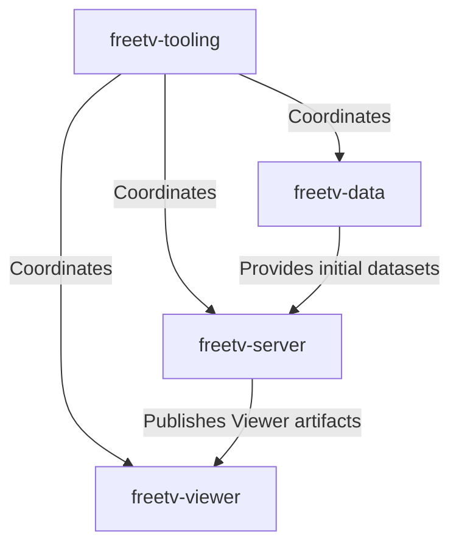

# FreeTV · [freetv.today](https://freetv.today)

FreeTV is an open-source platform for curating, publishing, browsing, and watching hand-picked television shows and movies from the [Internet Archive](https://archive.org/).

The project provides an easy-to-use Viewer for watching content and a graphical Admin Dashboard for organizing shows, playlists, thumbnails, and Viewer settings. MariaDB stores the authoritative Admin data, which is published as static artifacts for the Viewer.

FreeTV is developed and maintained by [Ken Dawson](https://github.com/kendawson-online).

## About FreeTV

The Internet Archive contains an enormous collection of public-domain and classic media, but finding and organizing that content can be difficult. FreeTV provides curated playlists and a straightforward interface for discovering and watching selected content.

FreeTV does not provide live television or IPTV services. Video content is hosted and served by the Internet Archive.

FreeTV version 3 separated the project into focused repositories for the Admin Dashboard, Viewer, distributable data, and cross-repository Tooling. Each repository can be worked with independently where appropriate, while Tooling supports workflows that combine them into a complete FreeTV site.

## Which Repository Do I Need?

You do not need to download or build every FreeTV repository. Choose the repository that owns the part of the project you want to use or modify.

| I want to... | Start here | Why? |
| --- | --- | --- |
| **Watch FreeTV** | Visit [freetv.today](https://freetv.today). | The hosted FreeTV Viewer runs directly in a modern web browser. |
| **Run or modify the Admin Dashboard** | [`freetv-server`](https://github.com/freetv-today/freetv-server) | Contains the Admin frontend, PHP API, MariaDB integration, First Run process, and publication system. |
| **Run or modify the Viewer** | [`freetv-viewer`](https://github.com/freetv-today/freetv-viewer) | Contains the end-user application that reads published FreeTV data. |
| **Inspect or distribute FreeTV datasets** | [`freetv-data`](https://github.com/freetv-today/freetv-data) | Contains official distributable datasets, Viewer artifacts, thumbnails, SQL packages, and release metadata. |
| **Run the repositories together** | [`freetv-tooling`](https://github.com/freetv-today/freetv-tooling) | Provides the coordinated development environment and cross-repository commands. |
| **Build a complete deployable FreeTV site** | [`freetv-tooling`](https://github.com/freetv-today/freetv-tooling) | Builds and verifies a production assembly. Tooling prepares the files but does not upload or deploy them automatically. |

## How the Repositories Work Together

The four FreeTV repositories have separate responsibilities but share defined data and build contracts.

* `freetv-server` provides the FreeTV Admin Dashboard, PHP API, MariaDB-backed management system, First Run process, and publication system.
* `freetv-viewer` provides the end-user application that consumes published static artifacts.
* `freetv-data` owns the official distributable datasets, Viewer artifacts, SQL packages, release packages, and integrity metadata.
* `freetv-tooling` coordinates cross-repository development, validation, data workflows, builds, and production assembly.

MariaDB is authoritative for data managed through the Admin Dashboard. The Viewer does not connect directly to MariaDB; it consumes the static JSON and thumbnail artifacts established during First Run and maintained through the publication workflow.

Tooling can assemble the Viewer, Admin Dashboard, PHP runtime, and published data into a verified production build. It does not automatically upload or deploy that build.

## 🚧 Current Status

- **App Version:** `3.1.1-beta`
- **Development Phase:** Early beta, work in progress.
- **Public Release:**  
  The main server and code will be made open source after reaching a stable 1.0.0 release, with full documentation and bug fixes.

---

## 👨‍💻 About the Developer

Free TV is managed and developed by a single developer.  
This is not a registered company or non-profit—just a passion project to make streaming easier for everyone.

- [kendawson-online on GitHub](https://github.com/kendawson-online)
- Feedback and suggestions are always welcome.

---

## 🗺️ Roadmap

- Real world testing of Preact/PHP server
- Write comprehensive documentation
- Develop and release additional viewer clients

---

## 📢 Stay Tuned

Follow [freetv.today](https://freetv.today) for updates

---

_This organization and its repositories are a work in progress. Thank you for your interest and patience!_
